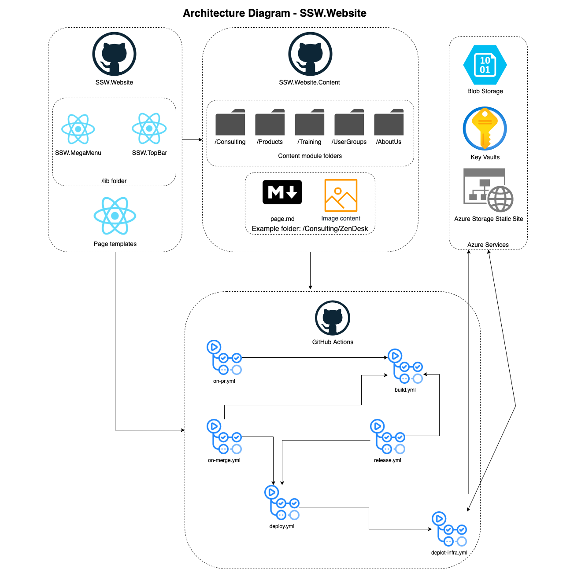

# Technologies and Architecture

This documents aims to provide an overview of the technologies used in this project and the architecture that will be used throughout its lifetime.

## Architecture Diagram(s)

**Figure: SSW Website Architecture Diagram**

## Coding Patterns

[Rules to Better Clean Architecture](https://www.ssw.com.au/rules/rules-to-better-clean-architecture) not applicable

## 3rd Party Libraries 

- [Gatsby Framework](https://www.gatsbyjs.com/)
- [React](https://reactjs.org/)
- [Bootstrap](https://getbootstrap.com/)

## 3rd Party services

- [Font Awesome](https://fontawesome.com/)
